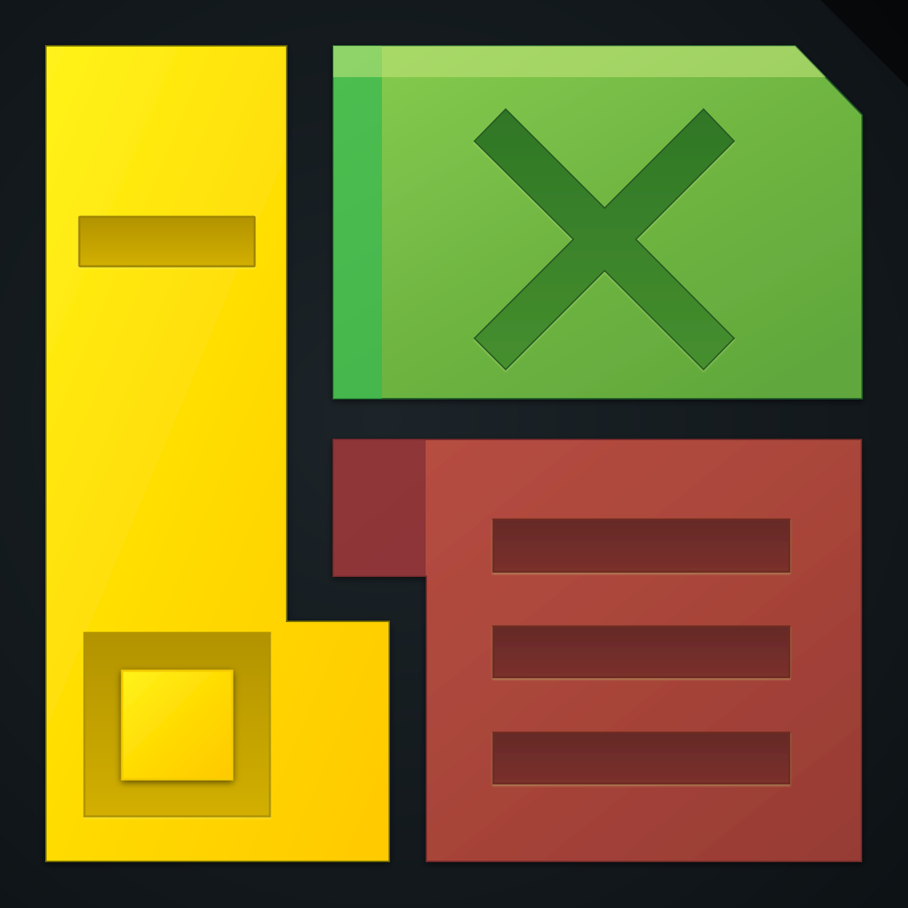

<p align="center">
  
</p>

# LDTK-Smartive

**LDTK-Smartive** is a fork of **Level Designer Toolkit (LDtk)** focused on `.aseprite` workflows, advanced tileset/editor tooling, and fork-specific authoring features while keeping normal LDtk project compatibility.

Links: [Latest Smartive release](https://github.com/RondeI33/ldtk/releases/latest) | [Smartive releases](https://github.com/RondeI33/ldtk/releases) | [Upstream LDtk](https://ldtk.io/) | [Haxe API](https://github.com/deepnight/ldtk-haxe-api)

[](https://github.com/RondeI33/ldtk)
[](https://github.com/RondeI33/ldtk/releases/latest)
[](https://github.com/RondeI33/ldtk/actions/workflows/test-windows.yml)

## Downloads

The same Smartive logo is used as the application and installer icon on every desktop build.

| Platform | Build |
| --- | --- |
| **Windows** | [Windows x64 installer](https://github.com/RondeI33/ldtk/releases/latest) |
| **macOS** | [Universal macOS DMG](https://github.com/RondeI33/ldtk/releases/latest) |
| **Linux** | [Linux x64 AppImage](https://github.com/RondeI33/ldtk/releases/latest) |

# Getting LDTK-Smartive latest version

Download the latest Windows, macOS, or Linux build from the [LDTK-Smartive releases page](https://github.com/RondeI33/ldtk/releases/latest).

# Building from source

## Requirements

 - **[Haxe compiler](https://haxe.org)**: you need an up-to-date and working Haxe install to build LDtk.
 - **[NPM](https://nodejs.org/en/download/)**: this package manager is used for install, branding, and packaging scripts. It is packaged with NodeJS.

## Installing required stuff

 - Open a command line **in the `ldtk` root dir**.
 - Install required Haxe libs:
 ```
 haxe setup.hxml
 ```
 - Install Electron and Node dependencies from the `app` directory:
 ```
 cd app
 npm i
 ```

## Compiling `master`

From the `app` directory run:

```
npm run compile
```

The compile command first materializes the Smartive branding assets from `app/buildAssets/smartive-logo.svg`, generating:

- `app/assets/appIcon.png`
- `app/buildAssets/icon.ico` for Windows
- `app/buildAssets/icon.icns` for macOS
- `app/buildAssets/icon.png` for Linux

It then compiles the Electron Main and Renderer Haxe targets.

## Compiling another branch

If you want to try a future version of LDtk, you can checkout branches named `dev-x.y.z` where x.y.z is version number.

**IMPORTANT**:
 - these *dev* branches might be unstable, or even broken. Therefore, it's not recommended to use them unless you plan to add or fix something on LDtk.
 - because *dev* branches might change quickly, you will need to update haxelibs often.
 - you will need to switch the *LDtk haxe API* to the **same** branch as LDtk. (adapt the branch name below accordingly):

```
haxelib git ldtk-haxe-api https://github.com/deepnight/ldtk-haxe-api.git dev-0.6.0
```

## Running

From a command line in the `app` folder, run:

```
npm run start
```

`npm run start` also regenerates the Smartive app icon before Electron starts.

## Running inside Hide (as an editor plugin)

LDtk can run embedded in a [Hide](https://github.com/heapsio/hide) tab.

First build the plugin (from the `ldtk` root dir):

```
haxe hide-plugin.hxml
```

This creates `app/nwjs/hide-plugin.js` (sources in `src/hide/plugin/`). Then add to the Hide project's `res/props.json` (`ldtk.project` is optional and resolves relative to `res/`):

```json
"plugins": [ "/path/to/ldtk/app/nwjs/hide-plugin.js" ],
"menu.extra": "<menu label='LDtk' component='ldtk.LdtkView'></menu>",
"ldtk.project": "path/to/world.ldtk"
```

LDtk then opens from the menu, in its own tab. Bonus: its CastleDB enum sync reads Hide's live database, unsaved changes included.

## Running in NW.js (instead of Electron)

The renderer can also run standalone in [NW.js](https://nwjs.io/), without the Electron main process:

```
nw app/nwjs
```

# Contributing

You can read the upstream Pull Request guidelines here:
https://github.com/deepnight/ldtk/wiki#pull-request-guidelines

# Related tools & licences

 - Tileset images: see [README](app/extraFiles/samples/README.md) in samples
 - Haxe: https://haxe.org/
 - Heaps.io: https://heaps.io/
 - Electron: https://www.electronjs.org/
 - JQuery: https://jquery.com
 - MarkedJS: https://github.com/markedjs/marked
 - SVG icons from https://material.io
 - Default palette: "*Endesga32*" by Endesga (https://lospec.com/palette-list/endesga-32)
 - Default color blind palette: "*Colorblind 16*" by FilipWorks (https://github.com/filipworksdev/colorblind-palette-16)
